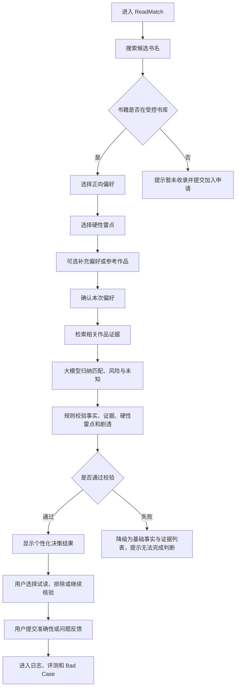

# ReadMatch PRD v1 草案

版本：v0.2
形成日期：2026-08-09
所有权：双方共创，用户最终决策
状态：P0 流程与异常策略已确认；待产品定位/书库覆盖策略、数据 Schema 和 AI Workflow 完成后升级为 v1.0

## 0. 文档使用说明

本文件不是助手替项目负责人生成的最终 PRD。已冻结的用户、场景、范围和指标直接继承自 MVP 决策工作表；交互细节、异常策略和验收标准需要项目负责人理解并确认。

相关文件：

- `00-mvp-scope-decision-workbook-v1.md`；
- `../PROJECT_STATUS.md`；
- `../PROJECT_COLLABORATION_AND_OWNERSHIP.md`。

## 1. 产品概述

### 1.1 产品名称

ReadMatch

### 1.2 一句话定义

ReadMatch 是一个基于证据的个性化小说决策系统。第一版面向纯爱/耽美读者：当用户已经知道一本候选小说但不确定是否适合自己时，系统基于受控作品信息和可追溯读者证据，输出匹配点、可能风险和未知项，帮助用户决定试读、排除或继续核验。

### 1.3 第一版核心价值

不是帮助用户发现更多书名，而是减少用户获得候选后在阅读平台、社交内容、评论和避雷帖之间反复核验的成本。

第一版要证明：

> 相比直接询问通用大模型，受控书库、可追溯证据、硬性雷点检查和未知项表达能否产生更准确、更可信、更容易评测的决策结果。

## 2. 背景与证据

### 2.1 已有研究

- 31 份候选有效问卷；
- 28 个主动找书事件；
- 19 个弃书/踩雷事件；
- 小红书 AI 搜索与晋江精准搜索两份任务记录；
- 目标用户 v1、问题定义 v1 和竞品综合 v1。

### 2.2 关键证据

- 14/31 出现主动找书但未顺利获得满意结果；
- 19/31 有近期弃书经历；
- 16/19 如果提前知道关键问题，会避免或大概率避免开始；
- 用户关注的不只是题材，还包括人物、关系、节奏、文风、逻辑、情绪强度和雷点组合；
- 通用 AI 和社交内容能快速提供候选，但来源、事实和负面条件需要核验；
- 阅读平台提供真实书库，但复杂偏好需要用户转换成标签，文风和雷点仍需跨平台确认。

### 2.3 当前仍未证明

- ReadMatch 一定比直接询问大模型准确；
- 用户一定愿意完成偏好输入；
- 受控小型书库能够覆盖真实候选；
- 用户会因为证据和未知项改变决定；
- 证据归纳能稳定避免雷点遗漏；
- 产品具有长期留存或付费价值。

## 3. 目标用户和使用场景

### 3.1 首批目标用户

对人物关系、文风、节奏和雷点有明确要求，并且在开始一本候选纯爱小说前需要进行二次判断的读者。

### 3.2 必要行为特征

至少满足以下两项：

- 近期有主动找书、弃书或踩雷经历；
- 能说出至少一个题材以外的偏好；
- 有明确不能接受的情节或雷点；
- 获得候选后会看书评、试读或跨平台核验；
- 如果提前知道关键问题，会避免开始阅读。

### 3.3 核心场景

> 用户已经听说或找到一本纯爱小说，但不确定它是否符合自己的偏好。用户希望在开始投入阅读时间前，确认匹配点、可能雷点、证据和未知项。

### 3.4 非首批用户

- 只想获得大量书名的用户；
- 不关心细粒度偏好和雷点的用户；
- 希望在产品内直接阅读完整小说的用户；
- 要求系统对主观体验给出绝对结论的用户；
- 不接受任何未知或相反评价的用户。

## 4. 产品目标与成功标准

### 4.1 求职项目目标

- 完成从问题定义、PRD、AI 方案、数据准备、实现、评测、优化到复盘的完整流程；
- 项目负责人能够脱离文稿说明所有关键取舍；
- 形成可运行 Demo、评测数据、Bad Case、用户测试和作品集。

### 4.2 模型质量目标

| 指标 | v1 暂定目标 |
|---|---:|
| 基础事实正确率 | 100% |
| 结论证据支持率 | ≥95%，P0 结论目标 100% |
| 已知硬性雷点召回率 | 核心评测集 100% |
| 无证据确定性结论数 | 0 |
| P0 严重错误数 | 最终核心评测集 0 |

### 4.3 系统目标

| 指标 | v1 暂定目标 |
|---|---:|
| 平均响应时间 | ≤10 秒，基线测试后调整 |
| JSON 解析成功率 | ≥98% |
| 单次分析成本 | 完整记录，首版暂不设金额门槛 |

### 4.4 产品目标

- 5 名测试用户中至少 4 名能够形成试读、排除或继续核验决定；
- 用户能够指出至少一个影响决定的匹配点、风险或未知项；
- 严重事实错误、硬性雷点遗漏和非主动关键剧透进入 P0 Bad Case。

## 5. MVP 范围

### 5.1 P0 功能

1. 从受控书库搜索并选择一本到候选小说；
2. 通过选项设置本次希望满足的偏好；
3. 通过独立选项设置硬性雷点；
4. 可选补充自然语言偏好和参考作品；
5. 系统展示并允许用户确认结构化偏好；
6. 检索指定作品中与本次偏好和雷点相关的证据；
7. 生成匹配点、风险、硬性雷点检查和未知项；
8. 显示书名、作者、平台和完结状态；
9. 显示证据编号、来源类型、证据强度和相反评价；
10. 提供试读、排除、继续核验三种行为反馈；
11. 提供事实错误、匹配错误、雷点遗漏、证据不一致和剧透等质量反馈；
12. 记录模型版本、Prompt 版本、检索结果、规则校验和用户反馈，用于评测和迭代。

### 5.2 P1 候选

- 保存少量用户偏好；
- 参考喜欢/不喜欢的作品；
- 候选书加入申请；
- 对同一本到书重新分析不同偏好；
- 分享不含私人偏好的分析结果；
- 跳转正版阅读平台。

P1 不进入首轮开发，除非 P0 完成且评测通过。

### 5.3 第一版明确不做

- 从零生成大量候选书名；
- 全网自动抓取；
- Agent 自主搜索；
- 多题材覆盖；
- 模型微调；
- 大规模书库；
- 小说正文和阅读器；
- 社交账号绑定；
- 完整长期用户画像；
- 付费和商业化；
- 书评截图上传与 OCR；
- 复杂推荐算法；
- 精细视觉和复杂动画。

## 6. P0 用户流程草案



## 7. 功能需求

### FR-01：书籍搜索与定位

#### 用户目标

快速找到自己想判断的作品，并确认书名和作者。

#### P0 规则

- 只允许选择受控书库中的作品；
- 搜索结果同时显示书名和作者，防止同名作品误选；
- 不允许大模型根据内部知识自由分析未收录作品；
- 未收录作品进入“申请加入书库”，不直接降级为通用大模型回答。

#### 已确认策略

- 未收录作品是否只显示“暂未收录”，还是允许用户留下书名申请加入；
- 第一版搜索使用手动下拉选择还是支持模糊匹配。

### FR-02：正向偏好输入

#### P0 规则

- 选项优先；
- 第一屏只展示 6—10 个高频选项；
- 支持展开更多分类；
- 用户可以只选 1—3 个条件；
- 提供“暂时想不起来”和“其他”；
- 自然语言补充为可选。

#### 初步分类

- 人物；
- 关系；
- 感情线；
- 剧情与节奏；
- 文风；
- 情绪体验；
- 结局和状态。

### FR-03：硬性雷点输入

#### P0 规则

- 与普通偏好分开；
- 明确说明“选择后系统将优先检查”；
- 支持多选；
- 提供“没有硬性雷点”和“其他”；
- 未选中的雷点不代表用户可以接受，只代表本次不作为硬性条件。

### FR-04：偏好确认

系统在分析前展示：

```text
本次希望满足
本次硬性雷点
补充说明
```

用户可以修改后再提交。

### FR-05：证据检索与 AI 分析

系统按本次偏好和雷点检索指定作品的相关证据，并把：

- 作品基础事实；
- 用户偏好；
- 用户硬性雷点；
- 编号证据；
- 证据来源类型；
- 剧透等级；

传入分析工作流。

大模型只能基于提供的证据进行归纳，不允许补充未提供的作品事实。

### FR-06：决策结果

#### 第一屏

1. 综合判断：可能适合 / 可能不适合 / 证据不足；
2. 最重要的匹配点；
3. 最需要注意的风险；
4. 用户硬性雷点检查；
5. 当前未知；
6. 建议动作。

#### 展开信息

- 基础事实；
- 具体匹配分析；
- 相反评价；
- 证据编号和来源类型；
- 证据强度；
- 剧透控制。

#### 输出约束

- 不使用“一定适合”“确定没有雷点”等无证据绝对表达；
- 事实必须来自数据库；
- 主观判断必须关联证据；
- AI 归纳必须与读者观点分开；
- 证据不足必须标记未知。

### FR-07：用户行为与质量反馈

#### 行为反馈

- 愿意试读；
- 排除；
- 继续核验。

#### 第一层质量反馈

```text
这个分析有帮助吗？
[有帮助] [不准确]
```

#### 不准确原因

- 匹配点不准确；
- 雷点判断错误或夸大；
- 遗漏硬性雷点；
- 基础事实错误；
- 证据与结论不一致；
- 未知项太多；
- 出现不希望看到的剧透；
- 其他。

#### 使用原则

用户主观反馈不自动覆盖书籍事实；反馈进入 Bad Case 后再判断是事实错误、标签歧义、主观差异还是系统问题。

## 8. AI 行为边界

### 大模型负责

- 理解可选自然语言补充；
- 从已有证据中归纳人物、关系、文风、节奏和雷点观点；
- 合并重复观点并保留冲突；
- 将用户偏好和作品证据进行个性化比较；
- 生成基于证据的匹配、风险和未知说明。

### 数据库和规则负责

- 书名、作者、平台和完结状态；
- 书籍身份与证据归属；
- 受控书库限制；
- 硬性雷点检查；
- 结论证据编号校验；
- JSON Schema；
- 剧透控制；
- 失败回退。

### P0 阻断错误

- 引用错书证据；
- 编造书名、作者、情节或来源；
- 无证据输出确定性结论；
- 遗漏评测集中已知的硬性雷点；
- 证据与结论方向相反；
- 未经用户主动展开显示关键剧透。

## 9. 异常与降级策略草案

| 异常 | P0 建议处理 | 状态 |
|---|---|---|
| 书籍未收录 | 不调用模型；提示暂未收录，可申请加入 | 已确认 |
| 同名书 | 强制用户根据作者选择 | 建议冻结 |
| 没有选择正向偏好 | 允许继续，但结果只检查雷点和基础事实 | 已确认 |
| 没有选择硬性雷点 | 允许继续，明确本次无硬性检查项 | 建议冻结 |
| 相关证据过少 | 输出有限已知和未知，不强行判断 | 已冻结 |
| 证据相互冲突 | 展示相反观点和证据强度 | 已冻结 |
| LLM 超时或失败 | 展示基础事实和检索证据，提示暂时无法归纳 | 已确认 |
| JSON 校验失败 | 自动重试一次；仍失败则降级 | 已确认 |
| 规则发现无证据结论 | 删除该结论并标记未知，记录 Bad Case | 建议冻结 |
| 发现关键剧透 | 默认折叠，用户主动展开 | 已冻结 |

## 10. 数据需求概览

详细 Schema 在下一份文件中定义。PRD 需要的核心实体：

- Book：作品基础事实；
- Evidence：可追溯读者观点证据；
- UserPreference：本次偏好和硬性雷点；
- AnalysisRun：一次分析的输入、版本和结果；
- Feedback：行为与质量反馈；
- EvaluationCase：离线评测 Case；
- BadCase：失败分类和修复状态。

## 11. 隐私、版权和安全

- 不要求真实姓名、手机号或社交账号；
- 第一版不上传私人笔记或书评截图；
- 本次偏好默认按会话使用，是否保存待确认；
- 不保存或再分发完整小说正文；
- 不将评论未提及解释为不存在雷点；
- 不把用户主观反馈直接当成书籍事实；
- 原始用户研究数据不进入产品数据库或 GitHub。

## 12. Baseline 与评测要求

### Baseline

书名和用户偏好直接交给通用大模型回答，不提供受控证据和规则校验。

### ReadMatch v1

数据库定位、证据检索、大模型归纳、规则校验和结构化输出。

### 核心评测集

30 条 Case，覆盖：

- 正常匹配；
- 硬性雷点；
- 证据不足；
- 观点冲突；
- 对抗输入。

项目负责人亲自审核至少 20 条。

## 13. 已确认的 P0 交互决策

### D-PRD-01：未收录作品（已确认）

**推荐：** 不允许直接调用通用大模型；显示暂未收录，并允许用户提交书名申请加入书库。

理由：如果未收录作品又回到大模型自由回答，会破坏 ReadMatch 的受控证据承诺，也使产品结果无法用同一套标准评测。

### D-PRD-02：用户只设置雷点、不设置正向偏好（已确认）

**推荐：** 允许继续。结果不输出个性化正向匹配，只显示基础事实、硬性雷点检查、风险和未知项。

理由：部分用户本次任务只是避雷，不应该强迫其构造正向偏好。

### D-PRD-03：偏好是否保存（已确认）

**推荐：** v1 默认不保存长期偏好。允许当前会话内返回修改；关闭或新会话后重新选择。

理由：降低账号、隐私、数据删除和长期画像复杂度。保存偏好放入 P1。

### D-PRD-04：LLM 失败（已确认）

**推荐：** 展示数据库基础事实和检索到的证据列表，提示“当前无法生成个性化归纳”，而不是返回空白或自由重试多次。

### D-PRD-05：JSON 校验失败（已确认）

**推荐：** 自动使用同一输入重试一次；第二次仍失败则降级，不向用户显示技术错误。

## 14. PRD v1.0 完成条件

- 项目负责人确认 D-PRD-01 至 D-PRD-05；
- 完成数据 Schema；
- 完成 AI Workflow 和错误回退图；
- 完成 P0 页面清单；
- 每条 P0 功能有验收标准；
- P0/P1/非目标无冲突；
- 与 30 条评测 Case 的字段可以对应。

## 15. 项目负责人面试掌握点

完成 PRD 后，项目负责人需要能说明：

- 为什么第一版只分析已收录作品；
- 为什么偏好输入以选项为主；
- 为什么硬性雷点与普通偏好分开；
- 为什么不把“未知”强行转换成结论；
- 为什么 LLM 失败时展示证据而不是继续编答案；
- 为什么 v1 不保存长期偏好；
- 用户反馈如何进入 Bad Case，而不是直接改写事实。

