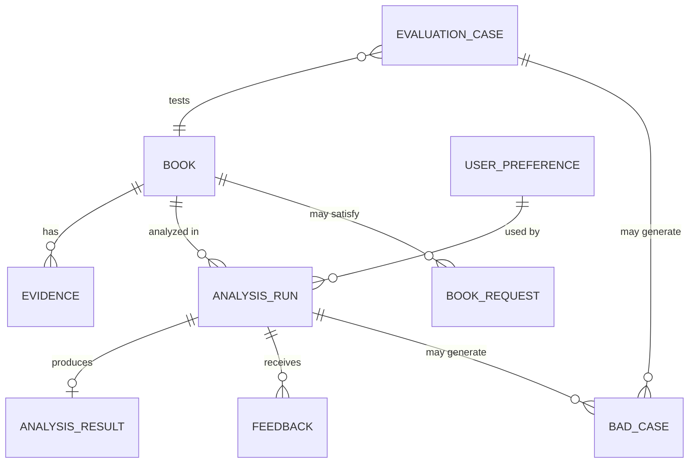

# ReadMatch MVP 数据 Schema 草案 v1

形成日期：2026-08-09
所有权：助手提供专业方案，双方共创，用户最终理解与确认
状态：待评审；不代表已开始建库

## 一、设计原则

1. 事实、读者观点、AI 归纳和未知分开存储；
2. 每条主观结论都能追溯到具体作品和证据；
3. 不为纯爱题材写死核心字段，题材特有内容放入扩展属性；
4. 第一版没有账号系统，使用匿名会话标识；
5. 不保存完整小说正文、完整书评、用户身份信息或原始问卷；
6. 支持 Baseline 对比、Prompt 版本、模型版本、延迟、成本和 Bad Case 回归；
7. 第一版使用简单关系型数据库即可，暂不需要复杂大数据系统。

## 二、实体关系



## 三、P0 核心实体

### 1. Book：作品基础事实

| 字段 | 类型 | 必填 | 来源/用途 |
|---|---|---:|---|
| book_id | string/UUID | 是 | 内部唯一 ID |
| title | string | 是 | 官方或平台可核对书名 |
| author | string | 是 | 官方或平台可核对作者 |
| aliases | string[] | 否 | 别名、旧名、简繁体或常见写法 |
| genre | string | 是 | v1 固定为纯爱，可支持未来扩展 |
| subgenres | string[] | 否 | 校园、无限流、仙侠、娱乐圈等 |
| platform | string | 是 | 晋江或其他正版/官方来源 |
| platform_book_id | string | 否 | 平台作品 ID，避免同名书 |
| completion_status | enum | 是 | completed / ongoing / unknown |
| official_source_ref | string | 是 | 官方来源引用或内部来源编号 |
| verified_at | datetime | 是 | 最后核对时间 |
| genre_specific_attributes | JSON | 否 | 题材扩展，不污染核心 Schema |
| catalog_status | enum | 是 | draft / review / active / retired |

#### 规则

- 书名、作者和状态由数据库读取，不由运行时大模型生成；
- `active` 作品必须达到最低证据标准；
- 同名作品必须通过作者或平台 ID 区分。

### 2. Evidence：作品证据

| 字段 | 类型 | 必填 | 来源/用途 |
|---|---|---:|---|
| evidence_id | string/UUID | 是 | 证据唯一 ID，例如 E-B001-001 |
| book_id | FK | 是 | 必须归属一本到明确作品 |
| source_type | enum | 是 | official / review / comment / researcher_note |
| source_ref | string | 是 | URL、页面编号、截图编号或内部来源记录 |
| evidence_text | text | 是 | 最小必要的短摘录或去版权风险摘要，不保存完整书评 |
| normalized_claim | text | 是 | 结构化后的证据含义 |
| aspect | enum | 是 | character / relationship / style / pacing / emotion / plot_logic / ending / warning |
| polarity | enum | 是 | positive / negative / mixed / neutral |
| warning_tags | string[] | 否 | 长期误会、人物降智、过度虐恋等 |
| spoiler_level | enum | 是 | none / mild / major |
| evidence_strength | enum | 是 | low / medium / high |
| extraction_method | enum | 是 | human / llm_reviewed / llm_unreviewed |
| reviewed_by_human | boolean | 是 | 是否经过人工审核 |
| created_at | datetime | 是 | 入库时间 |
| source_date | datetime | 否 | 原始内容日期 |

#### 最低证据标准草案

一本到书进入 `active` 前建议至少包含：

- 1 条可核对基础事实来源；
- 3—5 条与核心人物、关系、节奏、文风或雷点相关的证据；
- 至少覆盖 3 个 aspect；
- 所有 P0 硬性雷点结论必须由人工审核证据支持；
- 不允许只凭项目负责人记忆写成已确认事实。

### 3. PreferenceOption：偏好与雷点选项

| 字段 | 类型 | 必填 | 用途 |
|---|---|---:|---|
| option_id | string | 是 | 选项唯一 ID |
| label | string | 是 | 用户看到的文案 |
| category | enum | 是 | character / relationship / romance / pacing / style / emotion / ending / warning |
| option_type | enum | 是 | positive / hard_constraint / both |
| definition | text | 是 | 内部统一定义，避免标签歧义 |
| examples | string[] | 否 | 帮助用户和标注者理解 |
| active | boolean | 是 | 是否在界面展示 |
| sort_order | integer | 是 | 展示顺序 |

### 4. UserPreference：一次分析使用的偏好快照

| 字段 | 类型 | 必填 | 用途 |
|---|---|---:|---|
| preference_id | UUID | 是 | 本次偏好 ID |
| session_id | string | 是 | 匿名会话，不是用户真实身份 |
| positive_option_ids | string[] | 否 | 正向偏好 |
| hard_constraint_ids | string[] | 否 | 硬性雷点 |
| optional_text | text | 否 | 用户可选自然语言补充 |
| reference_books | JSON[] | 否 | 可选喜欢/不喜欢作品及原因 |
| normalized_text_claims | JSON[] | 否 | 从补充文本提取的结构化偏好 |
| user_confirmed | boolean | 是 | 用户是否确认结构化结果 |
| created_at | datetime | 是 | 创建时间 |
| expires_at | datetime | 否 | 会话偏好过期/删除时间 |

#### 规则

- v1 不建立长期用户画像；
- 不要求真实账号或联系方式；
- 选项数据优先，模型只处理可选补充文本；
- 分析前允许用户确认和修改。

### 5. AnalysisRun：一次分析运行记录

| 字段 | 类型 | 必填 | 用途 |
|---|---|---:|---|
| run_id | UUID | 是 | 运行唯一 ID |
| session_id | string | 是 | 匿名会话 |
| book_id | FK | 是 | 本次分析作品 |
| preference_id | FK | 是 | 本次偏好快照 |
| workflow_version | string | 是 | 工作流版本 |
| model_name | string | 是 | 模型名称 |
| prompt_version | string | 是 | Prompt 版本 |
| retrieved_evidence_ids | string[] | 是 | 实际提供给模型的证据 |
| started_at | datetime | 是 | 开始时间 |
| completed_at | datetime | 否 | 完成时间 |
| latency_ms | integer | 否 | 响应时间 |
| input_tokens | integer | 否 | 输入 Token |
| output_tokens | integer | 否 | 输出 Token |
| estimated_cost | decimal | 否 | 单次估算成本 |
| run_status | enum | 是 | success / retry / degraded / failed |
| validation_flags | JSON | 是 | 规则校验结果 |

### 6. AnalysisResult：结构化分析结果

| 字段 | 类型 | 必填 | 用途 |
|---|---|---:|---|
| result_id | UUID | 是 | 结果 ID |
| run_id | FK | 是 | 对应运行 |
| verdict | enum | 是 | likely_match / likely_mismatch / insufficient_evidence |
| match_points | JSON[] | 否 | 匹配点 + evidence_ids |
| risk_points | JSON[] | 否 | 风险 + evidence_ids |
| hard_constraint_checks | JSON[] | 是 | 每个硬性雷点的 present / possible / unknown / no_evidence |
| conflicting_views | JSON[] | 否 | 相反观点与证据 |
| unknown_items | JSON[] | 是 | 无法确认项 |
| suggested_action | enum | 是 | try / exclude / verify |
| summary | text | 是 | 第一屏摘要 |
| spoiler_sections | JSON[] | 否 | 折叠剧透内容 |
| result_schema_version | string | 是 | 输出 Schema 版本 |

#### 关键约束

- 每个 `match_point` 和 `risk_point` 必须包含 evidence_ids；
- `unknown_items` 不允许被写成“不存在”；
- verdict 是个性化建议，不是作品客观质量判决；
- 数据库事实不由 AnalysisResult 重新生成。

### 7. Feedback：用户反馈

| 字段 | 类型 | 必填 | 用途 |
|---|---|---:|---|
| feedback_id | UUID | 是 | 反馈 ID |
| run_id | FK | 是 | 对应分析 |
| session_id | string | 是 | 匿名会话 |
| user_action | enum | 否 | try / exclude / verify |
| helpful | boolean | 否 | 是否有帮助 |
| issue_types | string[] | 否 | match_wrong / warning_missed / fact_wrong / evidence_mismatch / too_unknown / spoiler / other |
| optional_text | text | 否 | 补充说明 |
| created_at | datetime | 是 | 提交时间 |
| reviewed_status | enum | 是 | pending / reviewed / dismissed / converted_to_bad_case |

#### 规则

- 用户主观反馈不能自动修改 Book 或 Evidence；
- 事实、证据和硬性雷点问题优先进入人工复核；
- “不喜欢”与“系统错误”必须区分。

### 8. BookRequest：未收录作品请求

| 字段 | 类型 | 必填 | 用途 |
|---|---|---:|---|
| request_id | UUID | 是 | 请求 ID |
| requested_title | string | 是 | 用户输入书名 |
| requested_author | string | 否 | 可选作者，降低同名歧义 |
| normalized_key | string | 是 | 去空格、标点和别名后的聚合键 |
| request_count | integer | 是 | 聚合请求次数 |
| first_requested_at | datetime | 是 | 首次请求 |
| last_requested_at | datetime | 是 | 最近请求 |
| status | enum | 是 | pending / researching / added / rejected |
| target_book_id | FK | 否 | 添加后关联 Book |
| evidence_availability | enum | 否 | unknown / low / sufficient |

## 四、评测与迭代实体

### 9. EvaluationCase：核心评测 Case

| 字段 | 类型 | 必填 | 用途 |
|---|---|---:|---|
| case_id | string | 是 | 评测编号 |
| case_type | enum | 是 | normal / hard_warning / insufficient / conflict / adversarial |
| book_id | FK | 是 | 目标作品 |
| preference_snapshot | JSON | 是 | 固定用户输入 |
| evidence_ids | string[] | 是 | 固定评测证据 |
| expected_facts | JSON | 是 | 应正确输出的事实 |
| expected_match_points | JSON[] | 否 | 预期匹配点 |
| expected_risk_points | JSON[] | 否 | 预期风险 |
| expected_unknown_items | JSON[] | 否 | 应标记未知 |
| prohibited_claims | string[] | 否 | 绝不能输出的无证据结论 |
| severity | enum | 是 | P0 / P1 / P2 |
| reviewed_by_owner | boolean | 是 | 是否由项目负责人亲自审核 |
| notes | text | 否 | 标注理由 |

### 10. BadCase：失败记录

| 字段 | 类型 | 必填 | 用途 |
|---|---|---:|---|
| bad_case_id | UUID | 是 | Bad Case ID |
| source_type | enum | 是 | evaluation / user_feedback / manual_test |
| source_id | string | 是 | 关联 Case、Run 或 Feedback |
| category | enum | 是 | wrong_book / fabricated_fact / unsupported_claim / warning_missed / evidence_mismatch / unknown_error / spoiler / parse_failure / retrieval_failure |
| severity | enum | 是 | P0 / P1 / P2 |
| root_cause | enum | 否 | data / retrieval / prompt / model / rule / UI / unknown |
| reproduction_input | JSON | 是 | 可复现输入 |
| observed_output | JSON/text | 是 | 实际错误输出 |
| expected_output | JSON/text | 是 | 正确预期 |
| fix_action | text | 否 | 修复方案 |
| status | enum | 是 | open / fixed / wont_fix / regression_added |
| created_at | datetime | 是 | 发现时间 |
| resolved_at | datetime | 否 | 解决时间 |

## 五、数据流

```text
Book + Evidence + PreferenceOption
↓
用户创建 UserPreference
↓
系统创建 AnalysisRun
↓
记录 retrieved_evidence_ids、模型和 Prompt 版本
↓
生成 AnalysisResult
↓
用户提交 Feedback
↓
错误进入 BadCase
↓
重要错误转为 EvaluationCase 回归测试
```

## 六、第一版实现建议

- 使用 SQLite 或 PostgreSQL；
- 结构化字段优先关系表或 JSON；
- 证据检索先使用 `book_id + aspect/warning_tags`；
- 第一版不因“使用 RAG”而强行引入向量数据库；
- 如果可选自然语言偏好或证据规模增加，再比较关键词、Embedding 和混合检索；
- 所有运行日志使用匿名 session_id；
- 原始问卷和研究数据不进入产品数据库。

## 七、需要项目负责人理解并确认

1. 是否同意第一版同时保存“短证据文本 + 结构化 normalized_claim”，而不是只保存 AI 总结？
2. 是否同意所有用于 P0 雷点判断的证据必须经过人工审核？
3. 是否同意第一版不使用向量数据库，先用作品 ID 和结构化标签检索，后续通过 Baseline 决定是否增加 Embedding？
4. 是否同意保留匿名 AnalysisRun 日志，用于评测、成本和 Bad Case，但不建立真实用户账号？
5. 是否理解用户反馈不能直接修改书籍事实，需要人工复核后进入 Bad Case？
