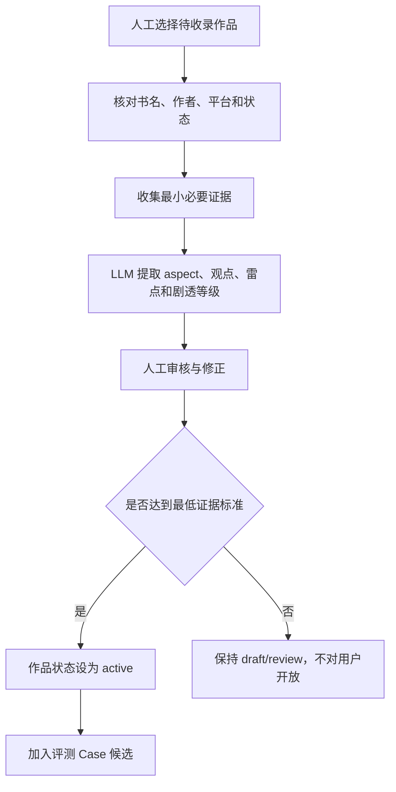
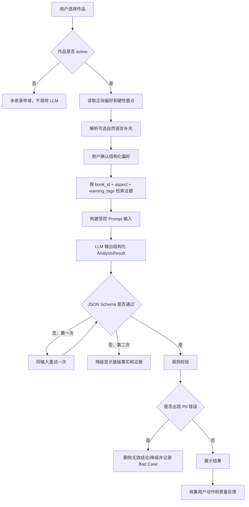

# ReadMatch AI Workflow 草案 v1

形成日期：2026-08-09
所有权：双方共创；助手提供技术产品方案，用户必须理解关键取舍
状态：核心 Workflow 取舍已确认并冻结 v1

## 一、为什么分为离线和在线两条流程

ReadMatch 不能在用户每次搜索时临时从零理解所有书评。第一版将高成本、需要审核的证据处理放在离线入库阶段；将个性化比较放在在线分析阶段。

这样可以：

- 避免每次重复处理同一批书评；
- 让证据先经过人工审核；
- 降低响应时间和调用成本；
- 更容易定位错误来自数据、检索还是生成；
- 支持固定评测集回归。

## 二、离线数据准备 Workflow



### LLM 在离线阶段负责

- 从短证据文本中提取结构化观点；
- 标记人物、关系、文风、节奏、逻辑、情绪、结局和雷点；
- 判断正向、负向、混合或中性；
- 初步判断剧透等级；
- 生成 normalized_claim。

### 人工必须审核

- 作品身份；
- 基础事实；
- P0 雷点；
- 证据是否支持 normalized_claim；
- 是否引用错书；
- 是否包含关键剧透；
- 相反观点是否被保留。

## 三、在线用户分析 Workflow



## 四、在线步骤输入与输出

### Step 1：作品定位

输入：用户搜索文本。

输出：唯一 book_id、书名、作者和状态。

规则：

- 必须从数据库选择；
- 同名书要求确认作者；
- 未收录不调用通用模型分析。

### Step 2：偏好结构化

输入：选项 ID、硬性雷点 ID、可选自然语言补充。

输出：UserPreference。

规则：

- 选项无需 LLM；
- 只有可选文本需要模型提取；
- 提取结果必须由用户确认；
- 模型不能扩大用户雷点含义。

### Step 3：证据检索

输入：book_id、positive_option_ids、hard_constraint_ids。

输出：相关 evidence_ids。

v1 推荐：

- 先根据 book_id 限定一本到书；
- 再按 aspect 和 warning_tags 检索；
- 对每个硬性雷点即使没有命中，也向生成阶段明确传入 `no_evidence_found`；
- 不把“没有检索到”转换成“不存在”。

### Step 4：受控生成

输入：

- 数据库基础事实；
- 用户偏好；
- 编号证据；
- 未命中雷点列表；
- 输出 JSON Schema；
- 禁止规则。

输出：AnalysisResult。

模型必须：

- 只使用输入证据；
- 每个匹配点和风险点引用 evidence_ids；
- 保留冲突观点；
- 将无充分证据的条件写入 unknown_items；
- 使用可能、部分读者认为、当前无法确认等概率/证据措辞；
- 不重新生成书名、作者和状态。

### Step 5：规则校验

校验项目：

1. 书籍身份是否一致；
2. 所有 evidence_ids 是否属于当前 book_id；
3. 匹配点和风险点是否都有证据；
4. 每个硬性雷点是否被 present / possible / unknown / no_evidence 覆盖；
5. 是否出现无证据的“没有雷点”；
6. 是否包含未展开的 major spoiler；
7. JSON 是否符合 Schema；
8. verdict 是否与硬性雷点检查明显矛盾。

### Step 6：结果展示和反馈

展示：

- likely_match / likely_mismatch / insufficient_evidence；
- 匹配、风险、硬性检查、冲突和未知；
- 试读、排除、继续核验；
- 有帮助/不准确及原因。

记录：

- 运行版本；
- 检索证据；
- 模型输入输出；
- 延迟、Token 和成本；
- 校验结果；
- 用户反馈。

## 五、Baseline Workflow

```text
书名 + 用户偏好文本
→ 通用大模型直接回答
```

Baseline 不提供：

- 受控数据库；
- 固定 evidence_ids；
- 规则雷点检查；
- 未知项强制规则。

必须使用与 ReadMatch 相同的用户输入和评测 Case，避免不公平比较。

## 六、为什么 v1 暂不使用向量数据库

当前任务是：

- 用户已经指定一本到书；
- 每本书证据规模有限；
- PreferenceOption 已经有结构化类别；
- 首要风险是证据正确和雷点遗漏，而不是从百万文档中召回。

因此 v1 可以使用：

```text
book_id 限定
+ aspect 标签
+ warning_tags
+ 简单关键词
```

先建立可解释 Baseline。

只有出现以下问题时再测试 Embedding：

- 自然语言补充与标签映射失败；
- 证据数量增加后结构化标签漏召回；
- 用户使用大量自定义偏好；
- 关键词无法识别隐含表达。

这不是否定 RAG。ReadMatch 仍然是“检索证据后再生成”的 Grounded Workflow，只是第一版检索不一定需要向量数据库。

## 七、错误归因框架

| 结果错误 | 可能根因 |
|---|---|
| 书名/作者错 | Book 数据或身份定位 |
| 引用错书 | Evidence 归属或检索 |
| 雷点遗漏 | Evidence 不足、标签错误、检索漏召回、Prompt 或规则 |
| 结论无证据 | Prompt、模型或规则拦截失败 |
| 未知判断错误 | Evidence 标注、Prompt 或评测预期 |
| JSON 失败 | 模型/Prompt/Schema |
| 剧透泄露 | Evidence 标注或展示规则 |
| 用户认为不准 | 主观差异、偏好映射、证据或生成，需要人工复核 |

项目迭代时不能只说“模型不够好”，必须定位到数据、检索、Prompt、模型、规则或 UI。

## 八、需要项目负责人理解并确认

1. 是否理解离线阶段处理和审核书籍证据，在线阶段只做本次个性化比较？
2. 是否同意 v1 不强行使用向量数据库，先用结构化标签检索，并通过实际漏召回决定是否增加 Embedding？
3. 是否同意所有硬性雷点都必须在结果中有状态，即使状态只是 unknown/no_evidence？
4. 是否同意规则发现 P0 错误时可以删除 AI 结论或降级，而不是优先保持结果完整？
5. 是否理解错误必须归因到数据、检索、Prompt、模型、规则或 UI，而不能统一归因为“大模型不准”？

## 九、项目负责人最终确认

项目负责人于 2026-08-10 确认：

1. 书籍证据的提取与人工审核放在离线阶段，用户每次使用时在线完成本次偏好比较；
2. v1 不强行使用向量数据库，先建立可解释的结构化检索 Baseline；
3. 每个硬性雷点必须在结果中有明确状态，即使只能标记 unknown/no_evidence；
4. 规则发现 P0 错误时可以删除 AI 结论或将结果降级，可信度优先于页面完整；
5. 错误必须归因到数据、检索、Prompt、模型、规则或 UI，不能统一归因为“大模型不准”。

**决策状态：已冻结 v1。**
